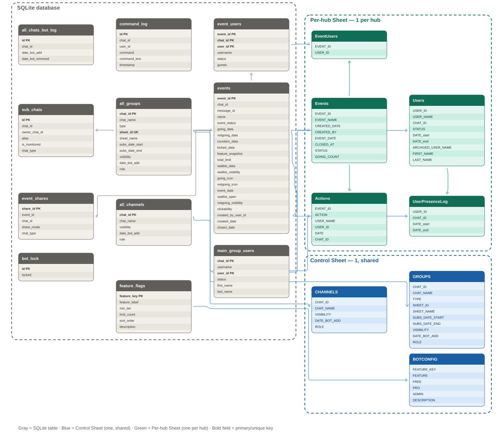

# Telegram Event Bot

A Telegram bot that manages RSVP-style events inside groups: create an
event with a Going/Not Going keyboard, track who's coming, share it to
other groups/channels, and export attendance to Google Sheets. Includes a
FREE/PRO subscription model with a per-feature tier and usage-limit system
that an owner can adjust live via `/updatefeature`, without a
redeploy.

Run `/help` inside the bot for the full command reference - this README
covers setup and architecture, not day-to-day usage.

## Stack

- Python 3.11, [python-telegram-bot](https://github.com/python-telegram-bot/python-telegram-bot) 20.3
- SQLite (local file, `database.db`) - all bot state
- Google Sheets via `gspread_asyncio` - optional, per-hub export (PRO) and a
  control sheet (owner-only, always on)
- Docker Compose for deployment

## Running it

```bash
cp .env.example .env   # fill in BOT_TOKEN, GOOGLE_CREDENTIALS_JSON, OWNER_USER_IDS, CONTROL_SHEET_ID
docker compose up -d --build
docker compose logs bot | grep "Bot v"
```

**Persisting the database across rebuilds** - `docker-compose.yml` must
mount the DB file outside the container, or every rebuild starts fresh:

```yaml
services:
  bot:
    volumes:
      - ./database.db:/app/database.db
```

See `tests/README.md` for running the test suite.

## Database and Google Sheets schema

SQLite tables and Google Sheets tabs shown together, grouped into three
non-overlapping zones, with relationship lines showing *which DB table's
data ends up in which Sheet tab*. Every table/tab shows its full column
list; bold fields are primary/unique keys. Table positions within each
zone are chosen to minimize crossing lines.



- **Gray** = SQLite table (single database, source of truth)
- **Blue** = Control Sheet - **one** spreadsheet, shared across the whole bot
- **Green** = Per-hub Sheet - **one separate spreadsheet per hub**, bound via `/setsheet` (shown as a stacked block to indicate multiple instances)

Key relationships:
- `all_groups.sheet_id` is the only link from a hub to its bound Google
  Sheet - `get_sheet_for_chat(chat_id)` is a direct `all_groups` lookup
  (PRO + active subscription + a sheet_id set, otherwise `None`). It's
  always called with the **hub's** chat_id, never a child chat's - every
  event's `events.chat_id` is always the hub it was created in, so
  callers never need to resolve a child chat up to its owner.
- `events.chat_id` is always the **hub** (main group) the event was
  created in; `event_shares` links that same `event_id` to every child
  chat it was shared to.
- `all_features` is read live on every gated action (`has_feature()`,
  `get_feature_limit_for_chat()`) - there's no cache, so
  `/updatefeature` takes effect immediately. `limit_count` is a single
  value that only ever caps usage while a chat's tier is exactly AT the
  feature's `min_tier` - any tier above is unlimited by construction,
  so there's no way to misconfigure a higher tier as more restricted
  than a lower one.
- `command_log` (every command run, incl. DMs) is DB-only - it has no
  Sheets counterpart, so it's omitted from the diagram above.
  `all_chats_bot_log` (add/remove history) IS mirrored to the Control
  Sheet's `chats_log` tab - see the column reference below.

**Full column reference:**

**Control Sheet** (`CONTROL_SHEET_ID` in `.env`, one per bot deployment,
owner-only, always kept in sync regardless of tier):

| Tab | Columns | Written by |
|---|---|---|
| `GROUPS` | CHAT_ID, CHAT_NAME, TYPE, SHEET_ID, SHEET_NAME, SUBS_DATE_START, SUBS_DATE_END, VISIBILITY, DATE_BOT_ADD | mirrors `all_groups`, on every `/setsub` |
| `CHANNELS` | CHAT_ID, CHAT_NAME, VISIBILITY, DATE_BOT_ADD | mirrors `all_channels` |
| `BOTCONFIG` | FEATURE_KEY, FEATURE, FREE, PRO, ADMIN, DESCRIPTION | mirrors `all_features`, on every `/updatefeature` |
| `chats_log` | CHAT_ID, DATE_BOT_ADD, DATE_BOT_REMOVE | mirrors `all_chats_bot_log` - the historical add/remove trail, pushed immediately whenever the bot is removed from a group/channel |

**Per-hub Sheet** (bound via `/setsheet`, PRO-only - a FREE hub writes
nothing to Sheets at all):

| Tab | Columns | Written by |
|---|---|---|
| `Users` | USER_ID, FIRST_NAME, LAST_NAME, USER_NAME, CHAT_ID, STATUS, DATE_start, DATE_end, ARCHIVED_USER_NAME | `/refreshusers`, `/refreshusersall` - one row per (user, chat); STATUS flips MEMBER/LEFT rather than deleting rows |
| `Events` | EVENT_ID, EVENT_NAME, CREATED_DATE, CREATED_BY, EVENT_DATE, CLOSED_AT, STATUS, GOING_COUNT | row appended on `/newevent`, columns F:H updated on Save & Close |
| `Actions` | EVENT_ID, ACTION, USER_NAME, USER_ID, DATE | every button click (going/notgoing/kick/save/...) |
| `EventUsers` | EVENT_ID, USER_ID | final attendee list, written once at Save & Close (main chat + every child chat combined) |
| `UserPresenceLog` | USER_ID, CHAT_ID, DATE_start, DATE_end | logged when someone leaves a monitored/main chat |

## How the DB and Sheets interact

SQLite is the source of truth and the only thing the bot ever *reads* back
- Sheets is a write-mostly export layer, never read to make a decision:

1. Every command works even with `GOOGLE_CREDENTIALS_JSON` unset or Sheets
   unreachable. `get_sheet_for_chat()` is a pure DB lookup (no network
   call) returning `None` for FREE tier or no sheet bound; separately,
   each `sync_*` function wraps its own `open_spreadsheet()`/API calls in
   a try/except that logs and returns on failure instead of raising -
   either way, a Sheets problem never blocks the user-facing action.
2. `all_groups`/`all_channels`/`all_features` are pushed to the Control
   Sheet *after* every write to those tables (`_push_control_sheet_*`),
   not read back from it - the Control Sheet is a live mirror for the
   owner to view, never a config source.
3. Per-hub tabs only ever get appended/updated in response to a specific
   SQLite-driven action (a button click, `/refreshusers`, Save & Close) -
   nothing about how the bot behaves is ever decided by what's currently
   in the Sheet.
